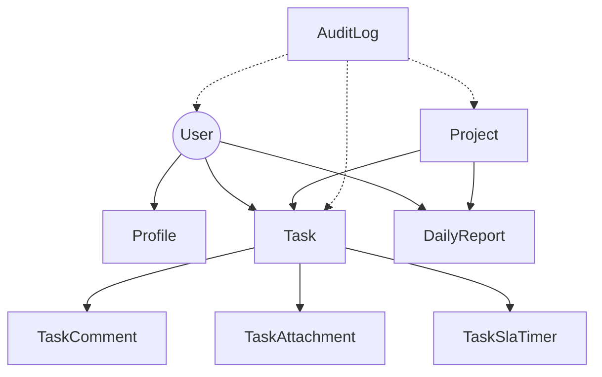

# 项目功能模块文档 V2.0

## 1. 概览
本项目是一个集任务管理、日报汇报、项目追踪、审计与统计分析于一体的综合协作平台。后端基于 Django 5.2 开发，前端采用 Django Templates + 原生 JS/CSS。

---

## 2. 模块详解

### 2.1 任务管理 (Tasks App)
负责全生命周期的任务管理，支持协作、状态流转与 SLA 监控。

- **核心模型**:
  - `Task`: 任务实体，包含状态、优先级、截止时间、负责人等。
  - `TaskAttachment`: 任务附件。
  - `TaskComment`: 任务评论与提及功能。
  - `TaskSlaTimer`: SLA 计时器，支持暂停/恢复逻辑。
  - `TaskTemplateVersion`: 任务模板，支持多版本与按角色/项目分发。

- **关键服务**:
  - `tasks.services.sla`: 计算 SLA 剩余时间、红/黄灯状态及暂停逻辑。
  - `tasks.views.admin_task_stats`: 绩效统计看板（KPIs、趋势图、分布图）。

- **接口**:
  - 任务列表/详情/编辑/删除 (CRUD)。
  - 批量操作 (Bulk Action)。
  - 导出 (CSV/Excel)。

### 2.2 汇报与统计 (Reports App)
核心业务模块，处理日报提交、团队管理及全局统计。

- **核心模型**:
  - `DailyReport`: 日报实体，包含工时、内容、关联项目。
  - `Project`: 项目实体（引用自 `projects` 应用）。

- **视图模块**:
  - `daily_report_views.py`: 日报创建（单条/批量）、编辑、列表。
  - `statistics_views.py`: 个人/团队/项目维度的统计面板。
  - `views_teams.py`: 团队成员管理、角色分配、项目授权。
  - `views_notifications.py`: 通知中心。

### 2.3 审计系统 (Audit App)
全方位记录用户操作与系统变更。

- **核心模型**:
  - `AuditLog`: 通用审计日志，记录 Action, Target, User, IP, Details (JSON Diff)。
  - `TaskHistory`: 专用于任务关键字段（状态/截止时间）的变更历史快照。

- **关键特性**:
  - `AuditMiddleware`: 自动捕获请求上下文（User, IP）。
  - `AuditService`: 提供统一的日志写入接口 `log_change`。

### 2.4 核心与公共 (Core App)
基础设施与公共配置。

- **核心模型**:
  - `Profile`: 用户扩展信息（职位、部门）。
  - `SystemSetting`: 动态系统配置（Key-Value）。
  - `ExportJob`: 异步导出任务状态追踪。

---

## 3. 依赖关系图

## 4. 权限体系现状

### 4.1 访问控制
- **@login_required**: 基础登录验证。
- **get_accessible_projects**: 基于用户身份（Superuser/Manager/Member）计算可见项目范围。

### 4.2 细粒度权限
- **Task**:
  - **Collaborator**: 仅允许修改状态 (`status`)，禁止修改标题、负责人等。
  - **Owner/Manager**: 完全编辑权限。
- **Project**:
  - **Manager**: 可以管理项目成员与设置。
  - **Member**: 仅查看。

---

## 5. 已知问题与待优化项 (待修复)
1. **代码冗余**: 部分视图中存在重复的权限校验逻辑 (`if not request.user.is_superuser...`)。
2. **硬编码**: 状态与角色定义散落在 Model `choices` 中，建议统一管理。
3. **查询优化**: 部分统计视图 (`admin_task_stats`) 虽已优化，但仍有 N+1 查询风险，需持续监控。
4. **前端耦合**: 部分业务逻辑（如 SLA 倒计时）在前端 JS 中重复实现，应依赖后端 API 计算结果。
