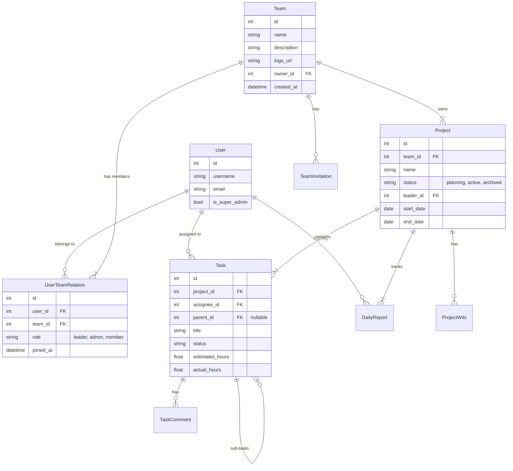
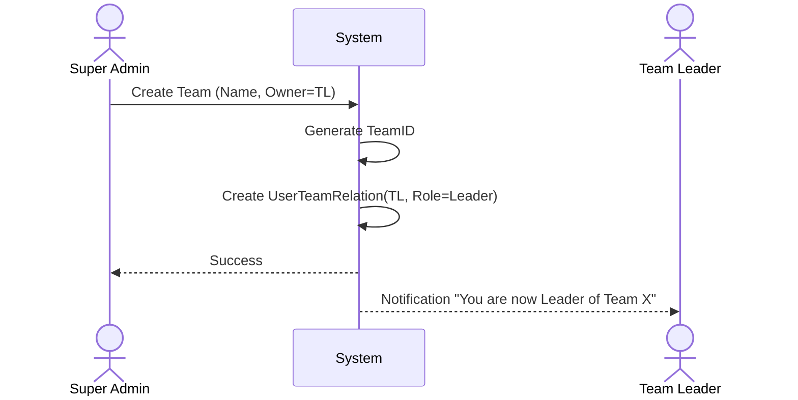
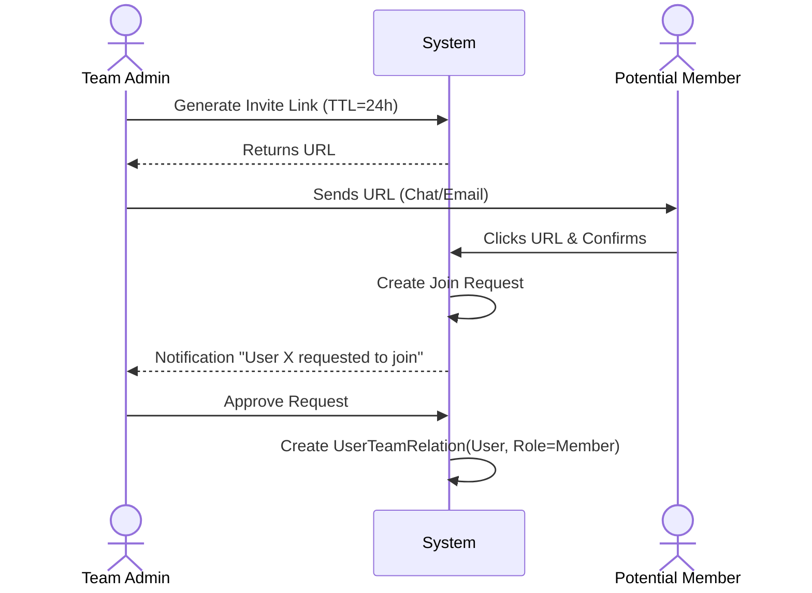

# Product Architecture V2: Team-Centric Organization

## 1. Product Requirements Document (PRD)

### 1.1 Overview
The goal is to restructure the "WorkReport" system into a **Team-Centric** project management platform. The core organizational unit will shift from individual users/projects to **Teams**. All projects, tasks, and reports will be strictly scoped within a Team context.

### 1.2 Core Architecture Principles
1.  **Team Centralization**: All entities (Projects, Tasks, Reports) must belong to a Team. No "orphan" projects allowed.
2.  **Hierarchical Permissions**:
    *   **Super Admin**: System-level control.
    *   **Team Leader (Owner)**: Full control over a specific team.
    *   **Team Admin**: Delegated management within a team.
    *   **Team Member**: Standard operational access.
3.  **Data Integrity**: Strong foreign key constraints ensuring `Task -> Project -> Team` lineage.

### 1.3 User & Team Management
#### 1.3.1 Roles & Permissions
| Role | Scope | Key Capabilities |
| :--- | :--- | :--- |
| **Super Admin** | System | Create/Disable Teams, User Audit, System Settings. |
| **Team Leader** | Team | **Owner** of the team. Manage all projects, members, billing (future), and delete team. |
| **Team Admin** | Team | Add/Remove members, Create Projects, Manage assigned projects. |
| **Team Member** | Team | View assigned projects, Create Tasks, Submit Reports. |

#### 1.3.2 Workflows
*   **Team Creation**: Only Super Admin can create a team and assign the initial Team Leader.
*   **Member Invitation**:
    *   **Direct Add**: Admin searches user by email/username and adds them.
    *   **Invite Link**: Admin generates a time-limited link. Users click to request access -> Admin approves.

### 1.4 Core Functional Modules

#### 1.4.1 Project Management
*   **Association**: Every project MUST link to a `Team`.
*   **Views**:
    *   **List**: Standard table with filtering/sorting.
    *   **Kanban**: Drag-and-drop board (To Do -> In Progress -> Done).
    *   **Gantt**: Timeline view for dependencies and scheduling.
    *   **Calendar**: Due dates and milestones.
*   **Fields**: Start/End Date, Status (Planning, Active, Paused, Archived), Leader (Team Admin/Leader).

#### 1.4.2 Task Management
*   **Structure**: Supports Sub-tasks (1 level deep initially).
*   **Features**:
    *   Assignments (Multiple assignees supported?).
    *   Dependencies (Task B requires Task A).
    *   Time Tracking (Estimated vs Actual).
    *   Comments & @Mentions.
    *   Attachments.

#### 1.4.3 Reporting System
*   **Daily/Weekly Reports**: Linked to specific Projects.
*   **Stats**:
    *   Burndown/Burnup charts.
    *   Member workload analysis.
    *   Project progress dashboard.

#### 1.4.4 Knowledge Base (Wiki)
*   **Team Wiki**: General team policies, onboarding.
*   **Project Wiki**: Requirements, Specs, Meeting notes.

### 1.5 Backoffice (Super Admin)
*   **Team Management**: List all teams, view stats (member count, storage usage), disable active teams.
*   **User Management**: Global user search, ban/unban users.
*   **Audit**: Global operation logs.

---

## 2. Data Architecture (ERD)

---

## 3. Business Process Flows

### 3.1 Team Creation & Setup

### 3.2 Member Invitation (Link Flow)

---

## 4. UI/UX Wireframes

### 4.1 Team Dashboard (Landing Page)
*   **Header**: Team Selector (Dropdown), User Profile, Notifications.
*   **Sidebar**:
    *   **Overview**: Dashboard.
    *   **Projects**: List of active projects.
    *   **My Tasks**: Tasks assigned to me across all projects.
    *   **Reports**: Daily/Weekly report submission.
    *   **Wiki**: Knowledge base.
    *   **Settings** (Admin only): Members, Integrations.
*   **Main Content Area**:
    *   **Stats Cards**: "Active Projects", "Pending Tasks", "Overdue Items".
    *   **Recent Activity Stream**: "John completed Task A", "Alice commented on Task B".
    *   **My Work**: Quick list of today's tasks.

### 4.2 Project Kanban Board
*   **Toolbar**: Search, Filter by Assignee, Group by (Status/Priority), View Switcher (List/Board/Gantt).
*   **Columns**: "To Do", "In Progress", "Review", "Done" (Customizable).
*   **Card**:
    *   Title, Priority Badge (High/Med/Low).
    *   Assignee Avatar.
    *   Due Date (Red if overdue).
    *   Subtask progress (e.g., 2/5).

### 4.3 Super Admin Console
*   **Grid Layout**:
    *   **Teams Table**: ID, Name, Leader, Member Count, Created At, Status, Actions (Edit/Disable).
    *   **System Health**: CPU/Memory usage, Error Rate (if integrated with monitoring).

---

## 5. Implementation Roadmap

### Phase 1: Foundation Refactoring (Week 1-2)
*   [ ] **Database Migration**: 
    *   Fix inconsistent `models.py` vs migrations.
    *   Implement `Team`, `UserTeamRelation` (replacing `TeamMember`).
    *   Migrate existing `Project`s to a default Team (or create teams based on owners).
*   [ ] **Auth & Permission**:
    *   Implement `TeamPermissionMixin` for views.
    *   Update login flow to select "Current Team Context".

### Phase 2: Core PM Features (Week 3-4)
*   [ ] **Project Views**: Implement Kanban (drag-and-drop API) and Gantt charts.
*   [ ] **Task Enhancements**: Add Sub-tasks, Time Tracking fields.
*   [ ] **Team Management UI**: Build the "Invite Member" and "Manage Roles" screens.

### Phase 3: Reporting & Wiki (Week 5-6)
*   [ ] **Report Association**: Enforce `Report -> Project` link strictly.
*   [ ] **Wiki Module**: Integrate a Markdown editor for Team/Project wikis.
*   [ ] **Notifications**: Webhook integration and in-app notification center.

### Phase 4: Admin & Optimization (Week 7-8)
*   [ ] **Super Admin Panel**: Dedicated `/admin/dashboard` (custom, not Django Admin).
*   [ ] **Performance**: Caching for Team Permissions and Project lists.
*   [ ] **Analytics**: Data visualization for team progress.
