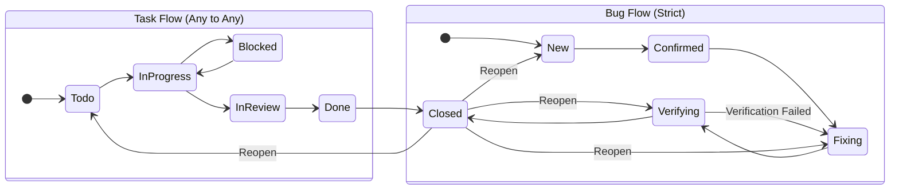

# 任务状态机说明 / Task State Machine

本系统根据任务分类 (`category`) 执行不同的状态流转规则。

## 1. 任务 (Category = TASK)
- **初始状态**: `todo` (待处理)
- **流转规则**: 无限制，允许任意状态间的跳转。
- **状态列表**:
  - `todo`: 待处理 / To Do
  - `in_progress`: 进行中 / In Progress
  - `blocked`: 阻塞中 / Blocked
  - `in_review`: 待评审 / In Review
  - `done`: 已完成 / Done
  - `closed`: 已关闭 / Closed

## 2. 缺陷 (Category = BUG)
- **初始状态**: `new` (新建)
- **流转规则**: 严格顺序流转 (Strict Sequential Flow)。
- **状态列表**:
  - `new`: 新建 / New
  - `confirmed`: 已确认缺陷 / Confirmed
  - `fixing`: 修复中 / In Progress (Fixing)
  - `verifying`: 验证中 / Verifying
  - `closed`: 已关闭 / Closed

### 状态流转图 (State Diagram)

## 3. 自动通知规则 (Notifications)

| 触发动作 | 目标状态 | 通知对象 |
| :--- | :--- | :--- |
| 缺陷修复完成 | `verifying` | 项目 QA (Role=QA) + 任务负责人 (Assignee) |
| 缺陷关闭 | `closed` | 任务负责人 (Assignee) |

## 4. 权限控制
- 状态流转校验在后端 API 层强制执行 (`TaskStateService`)。
- 前端根据当前状态动态过滤可选的目标状态。
